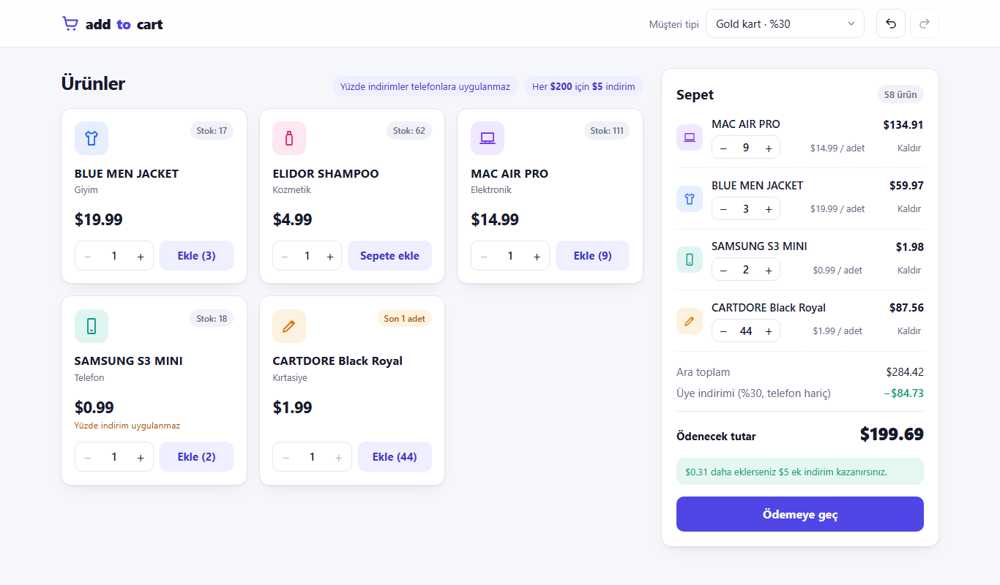
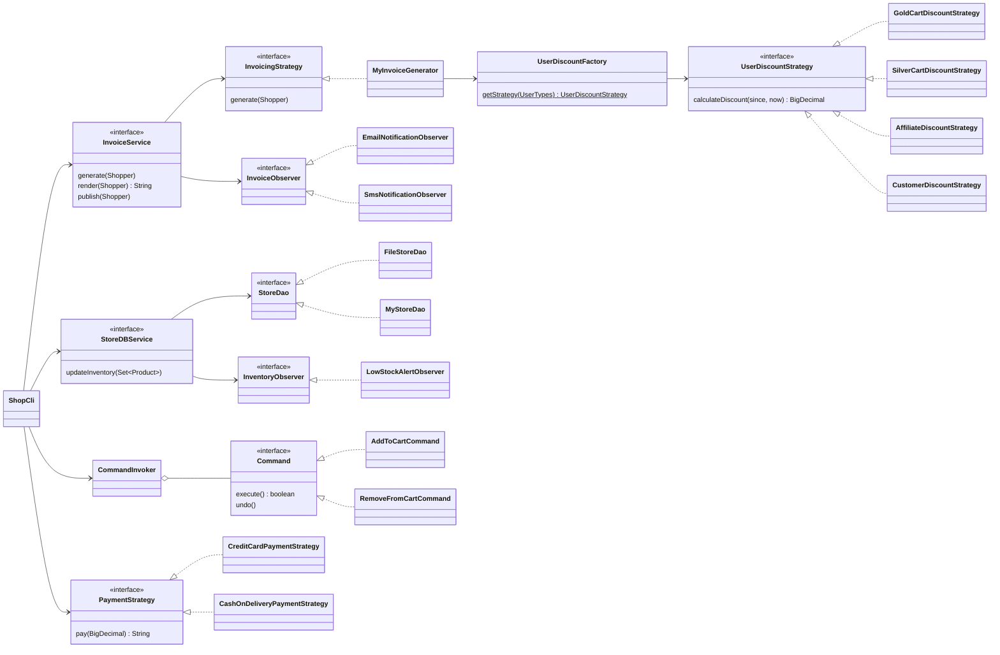

# Add To Cart

[](https://github.com/pietro379/add-to-cart-project/actions/workflows/ci.yml)

Bir perakende mağazasının indirim kurallarını uygulayan alışveriş sepeti ve fatura uygulaması. Hem **web arayüzü** hem **komut satırı** ile kullanılabilir; ikisi de aynı Java servislerini kullanır, kurallar tek bir yerde yazılıdır. Java 17 ile yazıldı; tasarım desenleri (Strategy, Factory, Observer, Command, Builder) ve para hesabında `BigDecimal` kullanımı üzerine kurulu.

### 👉 [Canlı Demo](https://pietro379.github.io/add-to-cart-project/)

> GitHub Pages yalnızca statik dosya sunduğu için demoda Java sunucusu çalışmaz. API istekleri, aynı indirim kurallarını uygulayan tarayıcı içi bir taklitle (`docs/demo-api.js`) yanıtlanır. Kuralların asıl kaynağı Java kodudur.



```text
========================================================================
                                 FATURA
========================================================================
Fatura no   : 3b44f4cf-a1de-44dd-b197-358c08917c09
Tarih       : 05 Ekim 2026, 22:34
Müşteri     : Ayşe (GOLD_CART)
Üyelik      : 05 Ekim 2026, 22:34
İletişim    : +90 555 000 00 00, musteri@example.com
------------------------------------------------------------------------
Ürün                     Tür           Adet   Birim fiyat         Tutar
------------------------------------------------------------------------
BLUE MEN JACKET          CLOTHING         2        $19.99        $39.98
SAMSUNG S3 MINI          PHONE            1         $0.99         $0.99
------------------------------------------------------------------------
                                               Ara toplam         $40.97
                        Üye indirimi (%30, telefon hariç)        -$11.99
========================================================================
                                           ÖDENECEK TUTAR         $28.98
========================================================================
```

## Problem

Bir perakende sitesinde şu indirimler geçerli:

| # | Kural |
| --- | --- |
| 1 | Mağazanın **Gold** kartına sahip kullanıcı %30 indirim alır. |
| 2 | **Silver** kartına sahip kullanıcı %20 indirim alır. |
| 3 | Mağaza çalışanı (**affiliate**) %10 indirim alır. |
| 4 | **2 yıldan uzun** süredir müşteri olan kullanıcı %5 indirim alır. |
| 5 | Faturadaki her **$200** için **$5** indirim yapılır (ör. $950 için $20). |
| 6 | Yüzde indirimler **telefonlara uygulanmaz**. |
| 7 | Bir faturada yüzde indirimlerden **yalnızca biri** uygulanır. |

Verilen bir fatura için ödenecek net tutarı bulan programı yazın.

### Hesaplama

```
ara toplam       = Σ birim fiyat × adet
yüzde indirim    = (telefon dışı ürünlerin toplamı) × kullanıcı oranı     → kuruşa yuvarlanır
$200 indirimi    = ⌊(ara toplam − yüzde indirim) / 200⌋ × $5
ödenecek tutar   = ara toplam − yüzde indirim − $200 indirimi
```

Kullanıcı oranı tipine göre tek bir değerdir (Gold 0.30, Silver 0.20, Affiliate 0.10, 2 yıldan eski müşteri 0.05, diğerleri 0). Kural 5, problem tanımında hangi tutara uygulanacağı belirtilmediği için yüzde indirimden **sonra** kalan tutara uygulanır. Bu karar `MyInvoiceGenerator` içinde tek bir yerde verilir ve testlerle sabitlenmiştir.

## Çalıştırma

Gereksinim: **JDK 17 veya üstü**. Maven kurmanız gerekmez; depodaki Maven Wrapper (`mvnw`) doğru sürümü kendisi indirir.

```bash
git clone https://github.com/pietro379/add-to-cart-project.git
cd add-to-cart-project

# Web arayüzü: http://localhost:8080 (Windows'ta ./mvnw yerine mvnw.cmd)
./mvnw -q compile exec:java -Dexec.mainClass=org.ak.billing.web.WebApp

# Komut satırı arayüzü
./mvnw -q compile exec:java

# Farklı bir envanter dosyası ve port ile
./mvnw -q compile exec:java -Dexec.mainClass=org.ak.billing.web.WebApp -Dexec.args="ornek-envanter.csv 9090"

# Testleri çalıştır
./mvnw test
```

### Web arayüzü

Ek bir sunucu ya da framework gerektirmez: JDK'nın yerleşik `HttpServer`'ı, mevcut servisleri bir JSON API olarak sunar (`org.ak.billing.web`). Arayüz düz HTML, CSS ve JavaScript'tir (`src/main/resources/web`). Sunucu yalnızca `localhost`'tan erişilebilir; her tarayıcı bir çerezle kendi sepetine bağlanır.

- Müşteri tipi değişince indirim dökümü anında güncellenir.
- Sepette adet artırma/azaltma, kaldırma; **Ctrl+Z / Ctrl+Y** ile geri al / yinele.
- Bir sonraki $5 indirime ne kadar kaldığı gösterilir.
- Stok rozetleri ("Son 3 adet", "Tükendi") sepetteki adet düşülerek hesaplanır.
- Ödeme penceresinde kart numarası sunucuda doğrulanır; geçersizse stoklar değişmez.
- Açık ve koyu tema, mobil uyumlu yerleşim.

| Uç nokta | Açıklama |
| --- | --- |
| `GET /api/state` | Ürünler, sepet ve indirim dökümü |
| `POST /api/customer` | `{customer: GOLD \| SILVER \| AFFILIATE \| LOYAL \| NEW, name?}` |
| `POST /api/cart/add` | `{productId, quantity}` |
| `POST /api/cart/quantity` | `{productId, quantity}`, 0 ürünü çıkarır |
| `POST /api/cart/remove` | `{productId}` |
| `POST /api/undo`, `/api/redo` | Son sepet işlemini geri al / yinele |
| `POST /api/checkout` | `{payment: card \| cod, cardNumber?}`, faturayı döner |

### Komut satırı örnek oturumu

```text
Adınız (boş bırakabilirsiniz): Ayşe

Müşteri tipiniz:
  [1] Gold kart                    %30 indirim
  [2] Silver kart                  %20 indirim
  [3] Mağaza çalışanı (affiliate)  %10 indirim
  [4] 2 yıldan eski müşteri        %5 indirim
  [5] Yeni müşteri
Seçiminiz: 1

Sepet: boş
[1] Ekle  [2] Çıkar  [3] Sepet  [4] Geri al  [5] Yinele  [6] Ödeme  [0] Çıkış
Seçiminiz: 1
 No  Ürün                     Tür                 Fiyat   Stok
------------------------------------------------------------------------
  1  BLUE MEN JACKET          CLOTHING           $19.99     20
  2  ELIDOR SHAMPOO           COSMETICS           $4.99     62
  3  MAC AIR PRO              ELECTRONICS        $14.99    120
  4  SAMSUNG S3 MINI          PHONE               $0.99     20
  5  CARTDORE Black Royal     STATIONERY          $1.99     45
Ürün no (vazgeçmek için Enter): 1
Adet (1-20, varsayılan 1): 2
Sepete eklendi: 2 x BLUE MEN JACKET ekleme

Sepet: 2 ürün · $39.98
...
Ödeme yöntemi: [1] Kredi kartı  [2] Kapıda ödeme: 1
Kart numarası (test için 4111 1111 1111 1111): 4111 1111 1111 1111
**** **** **** 1111 numaralı karttan $28.98 çekildi.
[E-POSTA] $28.98 tutarındaki fatura musteri@example.com adresine gönderildi.
[SMS] Fatura bilgisi +90 555 000 00 00 numarasına gönderildi.
Bizi tercih ettiğiniz için teşekkürler!
```

### Özellikler

- Aynı ürün tekrar eklenince adetler toplanır; stoku aşan ekleme reddedilir.
- Ürün listesindeki stok, sepetteki adet düşülerek gösterilir.
- **Geri al / yinele**: ekleme ve çıkarma işlemleri Command deseniyle geri alınabilir.
- Ödemede stoklar tek seferde düşülür. Bir ürünün stoku bile yetmezse hiçbir stok değişmez.
- Kart numarası Luhn algoritmasıyla doğrulanır ve maskelenerek gösterilir.
- Stok 5'in altına inince uyarı verilir. Ödemeden sonra e-posta ve SMS bildirimleri simüle edilir.
- Envanter `database.csv` dosyasında tutulur, dosya yoksa örnek ürünlerle oluşturulur.

## Mimari



| Desen | Nerede | Neden |
| --- | --- | --- |
| **Strategy** | `UserDiscountStrategy`, `InvoicingStrategy`, `PaymentStrategy` | Yeni bir üyelik tipi, fatura kuralı ya da ödeme yöntemi mevcut kodu değiştirmeden eklenir. |
| **Factory** | `UserDiscountFactory` | Kullanıcı tipinden doğru indirim stratejisini seçer; `switch` dağılmaz. |
| **Observer** | `InvoiceObserver`, `InventoryObserver` | Bildirimler ve stok uyarısı, fatura ve envanter servislerinden bağımsızdır. |
| **Command** | `AddToCartCommand`, `RemoveFromCartCommand`, `UpdateQuantityCommand`, `CommandInvoker` | Sepet işlemleri geri alınabilir ve yinelenebilir. |
| **Builder** | `UserDetails.Builder` | İsteğe bağlı alanları olan değiştirilemez kullanıcı nesnesi. |
| **DAO** | `StoreDao`, `FileStoreDao`, `MyStoreDao` | Envanterin nerede tutulduğu (CSV, bellek) servisten ayrılır. |

Bağımlılıklar `Main` içinde elle kurulur (constructor injection). `ShopCli` girdi ve çıktıyı dışarıdan aldığı için testte yazılı bir senaryoyla baştan sona çalıştırılabilir. `MyInvoiceGenerator` saati (`Clock`) dışarıdan alır; "2 yıldan eski müşteri" sınırı bu sayede sabit bir tarihle test edilir.

## Testler

`./mvnw test` 42 test çalıştırır:

| Test sınıfı | Ne doğrular |
| --- | --- |
| `MyInvoiceGeneratorTest` | Her kural ayrı ayrı: telefon hariç tutma, $950 → $20 örneği, tek yüzde indirim, 2 yıl sınırı, kuruş yuvarlama |
| `ShoppingApplicationTest` | Beş kullanıcı tipi için uçtan uca net tutar, stok düşümü, stok bitince hata |
| `CartCommandsTest` | Adet birleştirme, geri alma önceki adede dönme, yinele, stoku aşan ekleme |
| `MyStoreDBServiceTest` | Ödemede stok düşümü ve yetersiz stokta hiçbir stokun değişmemesi |
| `FileStoreDaoTest` | Dosya oluşturma, kalıcılık, bozuk satırın satır numarasıyla raporlanması |
| `PaymentStrategyTest` | Luhn doğrulaması, kart maskeleme, tutar biçimi |
| `ShopCliTest` | CLI senaryoları: Gold üye ödemesi, geri al/yinele, hatalı girdiler, boş sepet |
| `WebServerTest` | Gerçek HTTP istekleriyle API: canlı indirim dökümü, ödeme, geçersiz kart, stok aşımı, dosya yolu güvenliği |

Her push ve pull request'te testler GitHub Actions üzerinde çalışır (`.github/workflows/ci.yml`).

## Proje yapısı

```
src/main/java/org/ak/billing
├── Main.java                 Bağımlılıkları kurar, CLI'yı başlatır
├── ShoppingApplication.java  Envanterden N'er adet alıp fatura kesen örnek akış
├── cli/ShopCli.java          Etkileşimli menü
├── web/                      HTTP sunucusu (WebApp, WebServer) ve oturum başına sepet (ShopSession)
├── beans/                    Product, ShoppingCart, Invoice, UserDetails, Shopper
├── commands/                 Sepet işlemleri ve geri al/yinele geçmişi
├── constants/                Ürün ve kullanıcı tipleri, indirim oranları, sabitler
├── daos/                     CSV ve bellek içi envanter depoları
├── observers/                E-posta, SMS ve düşük stok bildirimleri
├── services/                 Sepet, envanter ve fatura servisleri
├── strategies/               İndirim, fatura ve ödeme stratejileri
└── helpers/Utility.java      Para, tarih ve fatura biçimlendirme
```

## Teknolojiler

Java 17 · JDK HttpServer · Gson · HTML/CSS/JavaScript · Maven (Wrapper) · JUnit 5 · Apache Commons Lang · GitHub Actions

## Kaynak ve Teşekkür

Bu proje, [Ali Cimen (@alicmn)](https://github.com/alicmn) tarafından geliştirilen [alicmn/add-to-cart-project](https://github.com/alicmn/add-to-cart-project) üzerine, izniyle geliştirilmiştir. Özgün kod ve commit geçmişi korunmuştur. Bu depoda eklenenler arasında web arayüzü, genişletilmiş test paketi, sürekli entegrasyon (CI) ve GitHub Pages demosu bulunur.
